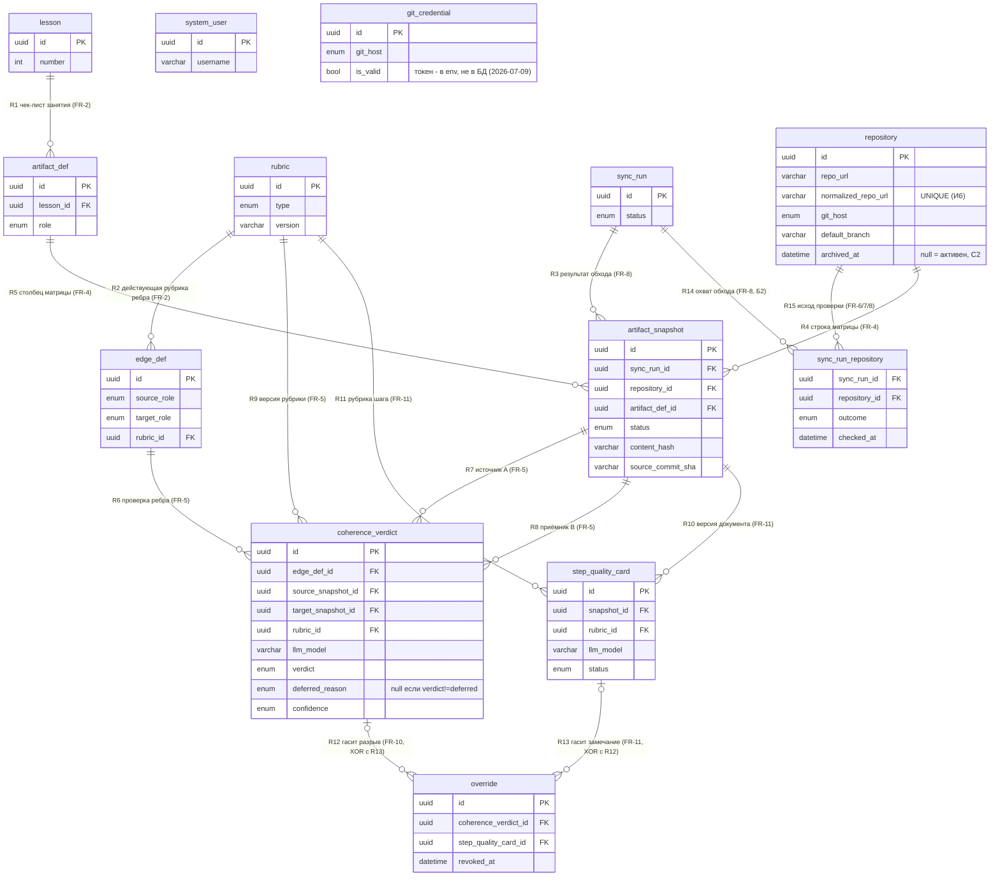

# Модель данных — Course Dashboard (итоговая, занятие 6)

**Дата:** 2026-07-02 (правки 2026-07-07: закрыты блокеры Б1, Б2; правки 2026-07-09: упрощения по митингу и решениям CEO — кеш-колонки, токен, И5, И8, И10) · **Статус:** канонический документ модели данных
**Основание:** `product/prd.md` (v2.4). Собран из трёх черновиков: словарь сущностей (draft 2), логическая модель (связи, кратности, состояние vs история) и адверсарное ревью схемы (8 сценариев, `reviews/ревью-схемы-данных-2026-07-02.md`). Черновики поглощены и перенесены в `archive/` — не править и не цитировать как актуальные.
**Уровень:** модель логическая — СУБД, физические типы и индексы сознательно не выбираются (стек — занятие 7, `ARCHITECTURE.md` + ADR-002).

> **Как читать статус модели.** Модель закрывает v1 (FR-0..FR-5, FR-8..FR-10) и закладывает сущности v2 (FR-11). Ревью подтвердило её сильные решения (история вместо состояния, устойчивость к `force-push`, ФИО вне периметра), но нашло **два блокера** (Б1, Б2 в §6) — **оба закрыты 2026-07-07** + **C1–C4 закрыты 2026-07-07 ARCHITECTURE.md v2**. С5 закрыт правкой Б2.

---

## 1. Словарь сущностей

**Персональные данные — общая рамка (решение CEO 2026-07-02):** именных данных в модели **нет**. Сущность `Student` исключена — сопоставление «репозиторий ↔ студент» преподаватель ведёт вне инструмента; `repo_url` (содержит логин студента) ПДн **не считается**. Поэтому удалять по R-PD4 («именные данные — через 30 дней после защиты») в базе инструмента **нечего**: именной реестр «ФИО ↔ адрес» живёт вне системы (BR-6), обезличенная статистика может храниться дольше. ⚠ PRD §7 всё ещё содержит противоположную формулировку («адрес репозитория — потенциально ПДн») — рассинхрон, вопрос В10 (§6). У каждой сущности ниже пометка «ПДн: нет» опущена как избыточная; отмечено только спорное поле.

### 1.1 SystemUser — учётная запись преподавателя (единственного пользователя v1)

| Атрибут | Тип | Описание |
|---------|-----|----------|
| id | UUID | Первичный ключ |
| username | string | Логин |
| password_hash | string | Хеш пароля (bcrypt/argon2) |
| failed_attempts | int | Счётчик неудачных попыток входа |
| locked_until | datetime, null | Блокировка до (null = не заблокирован); FR-0: 15 минут после 5 неудач |

Связей нет: v1 однопользовательский (PRD §3).

### 1.2 Repository — публичный git-репозиторий студента

Заменяет `Student` из draft 1: именных данных в инструменте нет.

| Атрибут | Тип | Описание |
|---------|-----|----------|
| id | UUID | Первичный ключ |
| repo_url | string | URL публичного репозитория. **Не ПДн — решение CEO 2026-07-02** (см. рамку выше и В10) |
| normalized_repo_url | string | Нормализованный URL (strip .git, lowercase, strip trailing /) — для UNIQUE-constraint (И6) |
| git_host | enum(GitLab, GitHub) | Хостинг (курс идёт на двух, BR-5) |
| default_branch | string | Ветка по умолчанию (негативный сценарий PRD §13: не всегда `main`) |
| added_at | datetime | Дата добавления (опоздавшие добавляются позже без потери истории, FR-1) |
| ~~availability~~ | enum(available, unavailable) | **Вычислимое из `SyncRunRepository`, в схеме не хранится (2026-07-09):** доступность = последний `outcome` (§1.13). Кеш-колонка вычеркнута — лишнее UPDATE-место и риск рассинхрона при 25 репо (маппинг на UI — ARCHITECTURE v3 §5.3) |
| ~~last_ok_sync_at~~ | datetime, null | **Вычислимое, в схеме не хранится (2026-07-09):** последний `checked_at` с исходом `ok_*` из `SyncRunRepository` |
| archived_at | datetime, null | Дата архивации (C2, ARCHITECTURE v2 §6). При `IS NOT NULL` репозиторий исключается из обходов и матрицы, но его снапшоты и вердикты сохраняются (FR-9). Ошибочный URL архивируется, не удаляется. |

### 1.3 Lesson — занятие курса, ось матрицы «репозиторий × занятие»

| Атрибут | Тип | Описание |
|---------|-----|----------|
| id | UUID | Первичный ключ |
| number | int | Порядковый номер (упорядоченность нужна FR-7: «2+ занятия подряд») |
| title | string | Название занятия |
| date | date | Дата занятия — база интервалов FR-7 «2+ занятия подряд» (Б2, добавлено 2026-07-07) |

### 1.4 ArtifactDef — определение ожидаемого артефакта (какой документ на каком занятии)

| Атрибут | Тип | Описание |
|---------|-----|----------|
| id | UUID | Первичный ключ |
| lesson_id | UUID | → Lesson.id (FR-2: чек-лист «по каждому занятию») |
| role | enum(interview, persona, user_story, prd, data_model, architecture, plan, code, tests) | Роль артефакта — метка матрицы и идентификатор для рёбер и рубрик шага |
| expected_pattern | string | Глоб/путь для поиска файла (напр. `**/prd.md`); правила неточного сопоставления — BR-3 |
| template_relative_path | string, null | Путь в репозитории-шаблоне для детекта заготовки (FR-4 «частично», BR-3) |

### 1.5 EdgeDef — ребро связности: пара «роль источника → роль приёмника»

| Атрибут | Тип | Описание |
|---------|-----|----------|
| id | UUID | Первичный ключ |
| source_role | enum | Роль документа-источника (связь с ArtifactDef — через домен `role`, не FK: В4, §6) |
| target_role | enum | Роль документа-приёмника |
| rubric_id | UUID | → Rubric.id — действующая версия рубрики ребра (FR-2) |

### 1.6 Rubric — версионированное правило для LLM-агента (одна строка = одна версия)

| Атрибут | Тип | Описание |
|---------|-----|----------|
| id | UUID | Первичный ключ |
| type | enum(edge, step) | `edge` — рубрика ребра (FR-5, v1); `step` — рубрика шага (FR-11, v2) |
| artifact_role | enum, null | Только `type=step`: роль проверяемого артефакта (у `edge` — null, пару задаёт ребро) |
| version | string | Семантическая версия (напр. «1.0») — входит в привязку вердикта |
| text | text | Полный текст инструкции агенту |
| items | json, null | Только `type=step`: пункты чек-листа `[{item_id, text}]` — к ним привязывается покрытие в StepQualityCard |
| created_at | datetime | Дата создания версии |

Правка рубрики = новая строка; старые версии неизменяемы (§3) — на них ссылаются старые вердикты.

### 1.7 GitCredential — токен доступа к Git API хостинга

| Атрибут | Тип | Описание |
|---------|-----|----------|
| id | UUID | Первичный ключ |
| git_host | enum(GitLab, GitHub) | Хостинг (по одной записи на каждый — инвариант И10) |
| is_valid | bool | false = токен протух → явная ошибка «обнови токен», а не тихо устаревшие данные (FR-3) |
| checked_at | datetime | Когда валидность проверялась последний раз |

**Сам токен в БД не хранится (решение CEO 2026-07-09):** живёт в env-переменной / файле с правами chmod 600 — не в БД, не в коде, не в логах (интерпретация NFR-3; «почему не строим крипто в БД» — ARCHITECTURE v3 §8). Колонка `encrypted_token` удалена. Связь с Repository — через домен `git_host`, FK избыточен (В6, §6).

### 1.8 SyncRun — сессия обхода репозиториев

| Атрибут | Тип | Описание |
|---------|-----|----------|
| id | UUID | Первичный ключ |
| started_at | datetime | Начало обхода |
| completed_at | datetime, null | Окончание (null = идёт или упал) |
| triggered_by | enum(schedule, manual) | По расписанию или по кнопке (FR-8) |
| status | enum(in_progress, completed, partial, failed) | `partial` = часть репозиториев недоступна (NFR-2) или деградация из-за лимитов API (NFR-4) |

Пообходный охват (какие репозитории проверены и с каким исходом) хранится в `SyncRunRepository` (§1.13, добавлена 2026-07-07 — закрывает Б2 и С5).

### 1.9 ArtifactSnapshot — наблюдение артефакта в конкретном репозитории в конкретном обходе

История, не состояние (§3): строки append-only, никогда не правятся и не удаляются.

| Атрибут | Тип | Описание |
|---------|-----|----------|
| id | UUID | Первичный ключ |
| sync_run_id | UUID | → SyncRun.id — наблюдение существует только как результат обхода |
| repository_id | UUID | → Repository.id — строка матрицы (FR-4) |
| artifact_def_id | UUID | → ArtifactDef.id — столбец матрицы (FR-4) |
| status | enum(found, partial, not_found) | FR-4 |
| partial_reason | json, null | JSON-массив причин «частично»: `["inexact_name", "wrong_place", "template_copy"]`. Пустой массив `[]` = нет причин (не partial). Несколько причин не теряются (C3, ARCHITECTURE v2 §6). |
| file_path | string, null | Фактический путь в репозитории |
| source_commit_sha | string, null | SHA коммита — устойчивость хронологии к `force-push` (FR-9) |
| content_hash | string, null | Хеш содержимого — инкрементальный обход (FR-8) и «версия документа» в четвёрке FR-5 / тройке FR-11 |
| observed_at | datetime | Момент наблюдения |

### 1.10 CoherenceVerdict — результат проверки связности по ребру для пары документов (ядро, FR-5)

| Атрибут | Тип | Описание |
|---------|-----|----------|
| id | UUID | Первичный ключ |
| edge_def_id | UUID | → EdgeDef.id |
| source_snapshot_id | UUID | → ArtifactSnapshot.id — провенанс: при каком наблюдении A вердикт впервые вычислен (идентичность — по хешам, Б1) |
| target_snapshot_id | UUID | → ArtifactSnapshot.id — провенанс наблюдения B (аналогично) |
| source_content_hash | string | Хеш содержимого A — элемент канонической четвёрки (Б1, 2026-07-07) |
| target_content_hash | string | Хеш содержимого B — элемент канонической четвёрки (Б1, 2026-07-07) |
| rubric_id | UUID | → Rubric.id — использованная версия рубрики (строка Rubric = версия) |
| llm_model | string | Идентификатор модели LLM — четвёртый элемент привязки |
| computed_at | datetime | Когда проверка завершилась (NFR-1: асинхронно, вне обхода — потому не FK на SyncRun; решение В1) |
| verdict | enum(ok, break, deferred) | Цела / разрыв / отложено (LLM недоступна или непарсируемый ответ — матрица работает, FR-5). ⚠ `deferred` исключён из уникальности четвёрки — partial unique index (C1 закрыт ARCHITECTURE v2 §4, ADR-003).
| deferred_reason | enum(llm_unavailable, parse_error), null | Только `verdict=deferred`: почему отложено (`llm_unavailable` — API недоступен; `parse_error` — ответ не прошёл `validate_llm_response`). |
| confidence | enum(high, medium, low) | Уверенность; на защите разрыв подсвечивается только при `high` (риск PRD §11) |
| entities_checked | int | Сущностей источника проверено |
| entities_found | int | Отражено (в т.ч. синонимом) |
| entities_excluded | int | Исключено явно |
| entities_lost | int | Потеряно (разрыв = ≥1) |
| points | json | ≤5 точек: `[{entity, source_quote, what_searched_in_target}]` |
| notes | text, null | Заметка преподавателю |

Привязка вердикта к четвёрке `(source_content_hash, target_content_hash, rubric_id, llm_model)` исключает «мигание»: пересчёт только при изменении четвёрки. Репозиторий выводится транзитивно через снапшоты (решение В2; инвариант И2). **Б1 закрыт (решение CEO 2026-07-07): канонический ключ идентичности — четвёрка хешей; FK на снапшоты — провенанс, не идентичность.** Реверт документа к прежнему содержимому «возрождает» прежний вердикт без пересчёта и без LLM-вызова (сценарий S5); дашборд резолвит: снапшот → хеш → вердикт.

### 1.11 StepQualityCard — карточка соответствия артефакта рубрике шага (v2, FR-11)

**Не балл и не оценка** (BR-2) — поля «score» нет и не появится. В схеме заложена заранее; в код не идёт до выполнения входа в v2 (US + рубрики шагов + пилот точности, PRD §5.2). **v2; в v1-коде модель не создаётся (решение CEO 2026-07-09):** файла `step_quality_card.py` в структуре v1 нет — таблица добавится миграцией при открытии v2 (ARCHITECTURE v3 §3.1).

| Атрибут | Тип | Описание |
|---------|-----|----------|
| id | UUID | Первичный ключ |
| snapshot_id | UUID | → ArtifactSnapshot.id — версия проверяемого документа |
| rubric_id | UUID | → Rubric.id (`type=step`) |
| llm_model | string | Идентификатор модели LLM |
| computed_at | datetime | Когда прогон завершился (NFR-1, аналогично CoherenceVerdict) |
| status | enum(done, deferred) | `deferred` = LLM недоступна |
| coverage | json | Покрытие пунктов: `[{item_id, verdict: done/partial/missing}]` — item_id из Rubric.items |
| remarks | json | ≤5 замечаний: `[{quote, comment}]` — цитаты из документа |
| notes | text, null | Заметка преподавателю |

Наследует паттерн ядра: привязка к тройке `(версия документа, версия рубрики, модель)`, пересчёт только при изменении, регрессии — golden set.

### 1.12 Override — отметка ложной находки преподавателем

Единственное исключение из BR-1: курирование находок, не ввод данных (FR-10). Обобщена под два вида находок: ложный разрыв (FR-10) и ложное замечание (FR-11).

| Атрибут | Тип | Описание |
|---------|-----|----------|
| id | UUID | Первичный ключ |
| coherence_verdict_id | UUID, null | → CoherenceVerdict.id — гасит ложный разрыв (FR-10) |
| step_quality_card_id | UUID, null | → StepQualityCard.id — гасит ложное замечание (FR-11) |
| reason | string | Причина («синоним», «переименование», …) |
| created_at | datetime | Когда поставлена |
| revoked_at | datetime, null | Когда снята (FR-10: отметка обратима; снятие — не удаление, история решений сохраняется) |

**XOR:** заполнена ровно одна из двух ссылок (инвариант И1). Привязка к конкретному вердикту (который сам привязан к версиям пары) реализует правило «не подсвечивается, пока пара не изменилась»: новая версия пары → новый вердикт → отметка на него не распространяется.

> Структура принята при сборке по варианту логической модели (два nullable-FK + XOR). Полиморфный вариант словаря (`finding_type` + `finding_id` без FK) отклонён по итогам ревью (сценарий S7): он лишает ссылку проверяемости. Судьба отметки при реверте пары решена вместе с Б1 (CEO, 2026-07-07): та же четвёрка → тот же вердикт → **активная отметка продолжает действовать** (ложный разрыв по тому же содержимому остаётся ложным).

### 1.13 SyncRunRepository — пообходная запись охвата (добавлена 2026-07-07: закрывает Б2 и С5)

Факт «репозиторий в этом обходе проверялся — с таким-то исходом», включая ключевое «проверено, изменений нет». История, append-only.

| Атрибут | Тип | Описание |
|---------|-----|----------|
| sync_run_id | UUID | → SyncRun.id |
| repository_id | UUID | → Repository.id |
| outcome | enum(ok_changed, ok_unchanged, repo_unavailable, auth_failed, skipped_rate_limit) | Исход проверки репозитория в этом обходе |
| checked_at | datetime | Момент проверки |
| detail | string, null | Диагностика (например, HTTP-код) |

Уникальность пары `(sync_run_id, repository_id)` — инвариант И11. Следствия: «актуально на ЧЧ:ММ» (FR-8) = последний `checked_at` с исходом `ok_*`; «хроники» FR-7 считаются только по подтверждённым проверкам (есть `ok_unchanged`, нет `ok_changed` за 2+ интервала между `lesson.date`); слепая зона FR-6 = последний исход `repo_unavailable`; `auth_failed` — не слепая зона, а сигнал «обнови токен» (FR-3); `skipped_rate_limit` отображается честно как «не проверялось». Доступность репозитория и время последнего успешного чтения — вычислимые проекции последней строки (кеш-колонки в `Repository` вычеркнуты 2026-07-09, §1.2). Точный маппинг исходов на статусы UI зафиксирован в ARCHITECTURE v3 §5.3 (С5 закрыт полностью).

### Чего в модели сознательно нет

- **Student / ФИО** — сопоставление «репозиторий ↔ студент» вне инструмента (решение CEO 2026-07-02); следствия — оговорки в трассировке FR-6 и FR-9 (§4) и вопрос В9.
- **Матрица, слепая зона, «хроники»** — представления, производные от ArtifactSnapshot + SyncRunRepository (последний `outcome`), не таблицы.
- **Оценки/баллы** — запрещены BR-2 во всех версиях; отсутствие поля = исполнение правила на уровне схемы.
- **Golden set** — артефакт репозитория курса (`evals/golden-set.md`), не данные продукта.
- **Сущности студенческого интерфейса** — BR-4: их не существует by design.
- **Сущность «LLM-модель»** — достаточно строкового идентификатора `llm_model` в привязке.
- **Контент документов** — не хранится, только `content_hash`. Доказательная цепочка FR-9: `source_commit_sha` + `content_hash` + `observed_at` доказывают, что такая версия существовала; точное содержание невосстановимо после force-push (цитаты в `points` — неверифицируемы). Решение принято сознательно (C4, ARCHITECTURE v2 §6).

---

## 2. ER-диаграмма

Каждая связь обоснована требованием (метки R1–R13; кратности разобраны граничным анализом в черновике шага 2, здесь — итог). Связи, которые нечем обосновать, не нарисованы — они в §6 (В4, В6, В7). В диаграмме — ключи и дискриминаторы; полный состав атрибутов канонически в §1.

`system_user` и `git_credential` намеренно без связей: пользователь один (PRD §3), токен связан с репозиториями через домен `git_host` (В6).

**Домены (enum):**

| Домен | Значения | Требование |
|-------|----------|------------|
| git_host | GitLab, GitHub | BR-5 |
| artifact_role | interview, persona, user_story, prd, data_model, architecture, plan, code, tests | FR-2, конвейер PRD §12 |
| availability | available, unavailable | FR-6, NFR-2 (вычислимый домен: проекция последнего `sync_outcome`, в схеме не хранится — 2026-07-09) |
| snapshot_status | found, partial, not_found | FR-4 |
| partial_reason | inexact_name, wrong_place, template_copy (JSON-массив) | BR-3 |
| sync_trigger | schedule, manual | FR-8 |
| sync_status | in_progress, completed, partial, failed | NFR-2, NFR-4 |
| sync_outcome | ok_changed, ok_unchanged, repo_unavailable, auth_failed, skipped_rate_limit | FR-6/7/8, Б2 (2026-07-07) |
| rubric_type | edge, step | FR-5 / FR-11 |
| verdict_value | ok, break, deferred | FR-5 |
| deferred_reason | llm_unavailable, parse_error | ARCHITECTURE v2 §5.2 |
| confidence_level | high, medium, low | FR-5; на защите подсветка только high (риск PRD §11) |
| card_status | done, deferred | FR-11 |

---

## 3. Инварианты и жизненный цикл

### 3.1 Состояние vs история — решение по каждой сущности

Сигналы PRD, требующие истории: **(а) динамика** — FR-7 «2+ занятия подряд», FR-8 «перечитываются только изменения»; **(б) доказательство прошлого** — FR-9 хронология на защите, FR-10 «отметка обратима», риск §11 «мигание вердикта»; **(в) переписывание задним числом извне** — FR-9 `force-push`. Плюс прямое указание PRD §13: «модель данных — история наблюдений, не текущее состояние».

| Сущность | Решение | Обоснование |
|----------|---------|-------------|
| SystemUser | состояние | FR-0: нужен только текущий счётчик попыток; истории входов PRD не требует |
| GitCredential | состояние | NFR-3: в БД — только `git_host`/`is_valid`/`checked_at`; сам токен в env-var (2026-07-09), копий не существует |
| Repository | состояние | FR-6 — про «сейчас»; динамику сдач хранит ArtifactSnapshot; доступность — вычислимая проекция `SyncRunRepository` |
| Lesson | состояние | справочник-конфиг, сигналов (а)/(б)/(в) нет |
| ArtifactDef | состояние | FR-2: правка чек-листа пересчитывает статусы вперёд; реконструкция прошлых конфигов не требуется (В12) |
| EdgeDef | состояние | то же; рёбра включаются по мере курса (PRD §12) |
| Rubric | **история** (append-only версии) | (б) вердикт привязан к версии рубрики; golden set требует репродуцируемости → правка = новая строка |
| SyncRun | **история** (строки не удаляются), но `status` мутирует | (а) «актуально на ЧЧ:ММ»: каждая строка — состоявшийся обход; `status` — жизненный цикл (in_progress→completed/partial/failed), поэтому из И5 исключён (2026-07-09) |
| SyncRunRepository | **история** (append-only) | (а) «актуально на» = последняя *проверка*, не последнее *изменение*; пообходный охват (Б2, 2026-07-07) |
| ArtifactSnapshot | **история** (append-only) | все три сигнала; при `force-push` наша запись с `source_commit_sha` остаётся, когда git-история уже переписана |
| CoherenceVerdict | **история** (append-only) | (б) доказательная цепочка FR-9 + защита от «мигания»: новая четвёрка = новая строка |
| StepQualityCard | **история** (append-only) | наследует паттерн ядра |
| Override | **история** (append-only) | (б) обратимость FR-10: снятие = `revoked_at`, не удаление |

### 3.2 Жизненный цикл ключевых сущностей

- **ArtifactSnapshot:** рождается только обходом → неизменяем → не удаляется никогда. Это фундамент доказательной базы (FR-9): запись наблюдения переживает `force-push` студента.
- **CoherenceVerdict:** создаётся асинхронно после обхода (NFR-1) → неизменяем → новый вердикт появляется только при изменении четвёрки `(hash A, hash B, версия рубрики, модель)`. «Мигание» исключено конструкцией. Идентичность при реверте — по четвёрке хешей (Б1 закрыт 2026-07-07): реверт возрождает прежний вердикт без пересчёта.
- **Rubric:** создана → используется ребром: `EdgeDef.rubric_id` указывает на действующую версию, а перенаправление на новую выполняет **только конфиг-реконсиляция из config.yaml** (единственный вызывающий — config_manager; ARCHITECTURE v3 §3.5, категория 3 — не свободный repoint) → заменена новой строкой; старая остаётся навсегда, на неё ссылаются исторические вердикты через `rubric_id` в четвёрке И3. Смена рубрики = обязательный прогон golden set (железное правило CLAUDE.md).
- **Override:** поставлена (`created_at`) → опционально снята (`revoked_at`) → повторная отметка = новая строка. На защите видно и текущее решение, и историю решений (риск PRD §11: «не отменён преподавателем»).
- **Repository:** добавлен импортом CSV (`added_at`) → доступность и время последнего успешного чтения вычисляются из `SyncRunRepository` (кеш-колонки вычеркнуты 2026-07-09). При архивации (`archived_at`) исключается из обходов и матрицы, но снапшоты и вердикты сохраняются (C2 закрыт ARCHITECTURE v2 §6).
- **SyncRun:** `in_progress` → `completed` | `partial` | `failed`; строка не удаляется, мутирует только `status` (единственный `update_*` — ARCHITECTURE v3 §3.5).

### 3.3 Инварианты

Правила, которые должны быть истинны всегда. На логическом уровне все они — текстовые; **физическая реализация каждого — в ARCHITECTURE.md v2 §4** (CHECK / UNIQUE / триггер / приложение).

- **И1 (XOR отметки):** у `override` заполнена ровно одна из ссылок `coherence_verdict_id` / `step_quality_card_id`.
- **И2 (согласованность вердикта):** оба снапшота `coherence_verdict` принадлежат одному `repository`, а роли их `artifact_def` совпадают с `source_role`/`target_role` ребра — иначе четвёрка бессмысленна.
- **И3 (уникальность привязки):** на одну четвёрку `(source_content_hash, target_content_hash, rubric_id, llm_model)` — не более одного вердикта; `deferred` исключён через partial unique index (C1 закрыт: ARCHITECTURE v2 §4, ADR-003). Аналогично для тройки `step_quality_card`. Четвёрка — канонический ключ идентичности вердикта (Б1, CEO 2026-07-07).
- **И4 (одна активная отметка):** на одну находку — не более одной отметки с `revoked_at is null`; история отметок не ограничена.
- **И5 (append-only):** строки `rubric`, `artifact_snapshot`, `coherence_verdict`, `step_quality_card`, `sync_run_repository` и факт создания `override` не изменяются и не удаляются (правка рубрики задним числом молча обесценила бы все её вердикты и golden set). `SyncRun` из И5 исключён (2026-07-09): его `status` — мутация жизненного цикла, это состояние, не журнал. Enforcement: дисциплина store.py + триггеры только на `artifact_snapshot`/`coherence_verdict` (решение CEO 2026-07-09; ARCHITECTURE v3 §3.5, §4).
- **И6 (уникальность репозитория):** `repo_url` уникален **после нормализации** (суффикс `.git`, регистр, завершающий слэш) — иначе один студент раздваивается в матрице.
- **И7 (типизация рубрик):** у `coherence_verdict.rubric_id` рубрика `type=edge`; у `step_quality_card.rubric_id` — `type=step`, и её `artifact_role` равна роли документа снапшота.
- **И8 (согласованность снапшота):** `status=partial` ⇔ заполнен `partial_reason`; `status=not_found` ⇒ `file_path`/`source_commit_sha`/`content_hash` пусты; `status=found|partial` ⇒ `content_hash` заполнен (иначе документ не может участвовать в четвёрке FR-5). Физическое выражение — один CHECK без подзапросов, включая полную ветку `not_found` (поправлено 2026-07-09; ARCHITECTURE v3 §4).
- **И9 (единственность наблюдения):** не более одного снапшота на `(sync_run_id, repository_id, artifact_def_id)`.
- **И11 (единственность охвата, 2026-07-07):** не более одной строки `sync_run_repository` на пару `(sync_run_id, repository_id)` — Б2.
- **И10 (уникальность справочников):** `lesson.number` уникален; пара `(source_role, target_role)` в `edge_def` уникальна; `git_credential` — одна запись на `git_host`; `system_user` — одна строка (v1; на этом держатся отсутствие автора у `override` (В7) и BR-4). Single-user enforce'ится **сидом одной строки при миграции + отсутствием роута создания пользователя** — `CHECK` с подзапросом в SQLite невозможен (2026-07-09; ARCHITECTURE v3 §4).

---

## 4. Двусторонняя трассировка

### 4.1 Сущность → требования

| Сущность | Без неё невыполнимы |
|----------|---------------------|
| SystemUser | FR-0, R-PD1 |
| Repository | FR-1, FR-3, FR-4, FR-5, FR-6, FR-9 (карточка репозитория) |
| Lesson | FR-2, FR-4, FR-7 |
| ArtifactDef | FR-2, FR-4, FR-5, FR-11 |
| EdgeDef | FR-5 |
| Rubric | FR-2, FR-5, FR-11 |
| GitCredential | FR-3, NFR-3, R-PD2 |
| SyncRun | FR-8, NFR-2, NFR-4, FR-4 (индикатор актуальности) |
| SyncRunRepository | FR-6, FR-7, FR-8 («актуально на»), FR-3 (диагностика `auth_failed`), NFR-2/NFR-4 (охват) |
| ArtifactSnapshot | FR-4, FR-7, FR-8, FR-9, PRD §13 (история наблюдений) |
| CoherenceVerdict | FR-5, FR-9, FR-10 |
| StepQualityCard | FR-11 (v2) |
| Override | FR-10, FR-11 (гашение ложного замечания) |

### 4.2 Каждое P0-требование → сущности-носители

| P0 | Сущности-носители | Статус покрытия |
|----|-------------------|-----------------|
| FR-0 аутентификация | SystemUser | ✓ |
| FR-1 подключение репозиториев | Repository | ✓; сводка «N/M/K» — результат операции импорта, не хранится; дубликаты-варианты URL ловятся через `normalized_repo_url` (И6); ошибочно добавленный репозиторий архивируется через `archived_at` (C2 закрыт) |
| FR-2 чек-лист + рёбра | Lesson, ArtifactDef, EdgeDef, Rubric | ✓; пересчёт при правке конфига — только вперёд, конфиг не версионируется (В12) |
| FR-3 доступ к Git API | GitCredential (`is_valid`), SyncRunRepository (`auth_failed`; доступность — вычислимая проекция) | ✓; причина недоступности различается через `outcome` (С5 закрыт 2026-07-07) |
| FR-4 матрица | Repository, Lesson, ArtifactDef, ArtifactSnapshot (матрица = проекция последних снапшотов) | ✓; `partial_reason` — JSON-массив, несколько причин не теряются (C3 закрыт) |
| FR-5 подсветка разрывов (ЯДРО) | EdgeDef, Rubric, ArtifactSnapshot (`content_hash`), CoherenceVerdict | ✓ **Б1 закрыт (CEO, 2026-07-07):** канонический ключ — четвёрка хешей, FK на снапшоты — провенанс; реверт возрождает вердикт |
| FR-8 автосинхронизация | SyncRun, SyncRunRepository, ArtifactSnapshot (`content_hash`, `observed_at`) | ✓ **Б2 закрыт (2026-07-07):** `SyncRunRepository` хранит «проверено, изменений нет»; «актуально на ЧЧ:ММ» = последняя проверка `ok_*` |
| FR-9 доказательная цепочка | ArtifactSnapshot (`source_commit_sha`, `observed_at`), CoherenceVerdict (`points`), Override (`revoked_at`) | ✓ против `force-push`; оговорки: карточка репозитория, не студента (решение CEO, В9); цитаты `points` неверифицируемы против стёртого коммита — контент не хранится (C4 закрыт сознательно, ARCHITECTURE v2 §6) |
| FR-10 отметка ложного разрыва | Override | ✓; отметка переживает реверт пары к прежним хешам (Б1, 2026-07-07) |
| NFR-1 производительность | `computed_at` у вердиктов/карточек — проверки асинхронны, вне обхода (решение В1) | ✓; статус «проверяется» — вычислимое состояние, не хранимое (В13) |
| NFR-2 устойчивость к сбоям | SyncRun (`status=partial`), SyncRunRepository (доступность — вычислимая проекция) | ✓; пообходный охват — `SyncRunRepository` (С5 закрыт 2026-07-07) |
| NFR-3 безопасность токена | GitCredential (`is_valid`, `checked_at`); сам токен — env-var, не в БД (решение CEO 2026-07-09, ARCHITECTURE v3 §8) | ✓ |
| NFR-4 лимиты Git API | SyncRun (`status=partial` при деградации) | ✓ (остальное — поведение обходчика, данных не требует) |
| R-PD1 доступ | SystemUser | ✓ |
| R-PD2 токен | GitCredential | ✓ |
| R-PD3, R-PD4 периметр и удаление | — именных данных в модели нет (рамка §1) | ✓ тривиально по решению CEO 2026-07-02; рассинхрон с PRD §7 — В10 |

**P1/P2 — для полноты картины:**

| Требование | Сущности-носители | Статус покрытия |
|------------|-------------------|-----------------|
| FR-6 слепая зона (P1) | SyncRunRepository (последний `outcome=repo_unavailable`) + Repository (`archived_at`) | половина «недоступны» ✓; половина «не добавлены» — **ДЫРА by design:** студент без строки в `repository` невидим; вычислимо только сверкой с внешним CSV-реестром при импорте (В9) |
| FR-7 «хроники» (P1) | Lesson (`number`, `date`), ArtifactSnapshot (история), SyncRunRepository | ✓ **Б2 закрыт (2026-07-07):** интервалы по `lesson.date`; «тишина студента» (`ok_unchanged`) отличима от «не проверялось» |
| FR-11 качество шага (P2, v2) | Rubric (`type=step`, `items`), StepQualityCard, Override | ✓ схемно заложено; реализация за-гейчена входом в v2 (PRD §5.2) |

---

## 5. Проверено сценариями (адверсарное ревью 2026-07-02)

Модель прогнана через 8 сценариев; минимум три — негативные по типам «источник недоступен / пользователь ошибся / объект переименован / данные задним числом», два — по P0 с самой сложной логикой. Полный отчёт с построчными раскладками — `reviews/ревью-схемы-данных-2026-07-02.md`.

| # | Сценарий | Результат | Критичность |
|---|----------|-----------|-------------|
| S1 | Протух токен GitLab посреди планового обхода (FR-3, NFR-2) | частично: явная ошибка токена ✓, но слепая зона не отличает «наш токен протух» от «репо недоступен», охват обхода не восстановим | серьёзно → С5 (закрыт 2026-07-07 правкой Б2) |
| S2 | Повторный CSV: тот же URL с суффиксом `.git` + опечатка (FR-1) | дыры: дубликат не распознан (история студента расщепляется), ошибочный репозиторий нельзя исключить | серьёзно → И6, С2 |
| S3 | Файл переименован + перемещён + заготовка одновременно (FR-4, BR-3) | противоречие: три истинные причины, поле `partial_reason` — одно, приоритет не задан | серьёзно → С3 |
| S4 | `force-push` с подделкой дат коммитов (FR-9) | **выдержала**: хронология по `observed_at` наших наблюдений неуязвима; дыра в доказательности — цитаты не верифицируемы против стёртого коммита | серьёзно → С4 |
| S5 | Реверт документа к прежнему содержимому (FR-5 + FR-10) | **не раскладывается**: вердикт для нового снапшота со старым хешем нельзя ни найти по FK, ни создать без нарушения И3 | блокер → Б1 (**закрыт 2026-07-07**) |
| S6 | Две недели без изменений при ежедневных обходах (FR-8 + FR-7) | **не раскладывается**: «нет изменений» и «не проверялось» неразличимы; «актуально на ЧЧ:ММ» врёт; у занятия нет даты | блокер → Б2 (**закрыт 2026-07-07**) |
| S7 | Защита: подсветка только high + не отменённых (FR-9, риск §11) | раскладка ✓ по структуре с двумя FK; вскрыт рассинхрон двух черновиков по структуре Override — устранён при сборке этого документа (§1.12) | закрыто |
| S8 | LLM недоступна → `deferred` → LLM вернулась (FR-5) | противоречие: `deferred` как строка вердикта конфликтует с уникальностью четвёрки (И3) и append-only (И5); поля `llm_model`/`confidence` у отложенной проверки не определены | серьёзно → С1 |

Сильные стороны, подтверждённые ревью: «история, не состояние» (§3), привязка хронологии к `observed_at` вместо дат git, вынос ФИО за периметр данных.

## 6. Открытые вопросы модели

### Блокеры — ЗАКРЫТЫ 2026-07-07

- **Б1. Идентичность вердикта.** FR-5 привязывал вердикт к четвёрке *хешей*, структура — к паре *snapshot_id*; на реверте документа способы расходились (сценарий S5). **Решение CEO 2026-07-07: канонический ключ идентичности — четвёрка хешей** `(source_content_hash, target_content_hash, rubric_id, llm_model)`; FK на снапшоты — провенанс, не идентичность; активная отметка FR-10 переживает реверт пары к прежним хешам. Правки: §1.10, §1.12, И3.
- **Б2. Инкрементальность против FR-7 и FR-8.** «Проверено, изменений нет» не было представлено ничем; у `lesson` не было даты (сценарии S6, S1). **Закрыт правкой модели 2026-07-07:** добавлены `SyncRunRepository` (§1.13, инвариант И11) и атрибут `lesson.date`. Заодно закрывает С5.

### Серьёзные — ЗАКРЫТЫ ARCHITECTURE v2 (2026-07-07)

- **С1. `deferred` — не вердикт.** «Отложено из-за недоступности LLM» — состояние очереди, а не результат: у него нет осмысленных `llm_model`, `confidence`, счётчиков, и оно занимает четвёрку (И3), не давая записать настоящий вердикт после восстановления LLM при append-only (И5). **Закрыт:** partial unique index `WHERE verdict != 'deferred'` (ARCHITECTURE v2 §4, И3) + добавлено поле `deferred_reason` для диагностики. Сценарий S8.
- **С2. Жизненный цикл Repository.** Нет состояния «исключён из группы». **Закрыт:** добавлен `archived_at` (ARCHITECTURE v2 §6). Ошибочный URL архивируется, не удаляется; отчисленный студент перестаёт участвовать в обходах и матрице. Сценарий S2.
- **С3. `partial_reason` — одно значение.** Файл может быть одновременно переименован, перемещён и являться заготовкой; поле вмещает одну причину. **Закрыт:** `partial_reason` — JSON-массив; приоритет отображения `template_copy > wrong_place > inexact_name` (ARCHITECTURE v2 §6). Сценарий S3.
- **С4. Верифицируемость цитат.** `points` хранит цитаты, но само содержимое документа — нигде (только `content_hash`); после `force-push` проверить цитату не по чему. **Закрыт сознательным решением:** контент не храним; доказательная цепочка строится на `content_hash` + `source_commit_sha` + `observed_at`. Добавлено в «Чего в модели сознательно нет». Сценарий S4.
- **С5. Диагностика недоступности.** **Закрыт 2026-07-07** правкой Б2: `SyncRunRepository.outcome` + `detail` различают причины, охват обхода восстановим. **С5-остаток (маппинг исходов на статусы UI) закрыт 2026-07-09:** таблица маппинга зафиксирована в ARCHITECTURE v3 §5.3 (`repo_unavailable` = слепая зона; `auth_failed` = баннер «обнови токен», не слепая зона; `skipped_rate_limit` = честное «не проверялось»; `ok_*` = норма/вход в хроники FR-7). Сценарий S1.

### Прочие (унаследованы из черновиков)

- **В4. EdgeDef ↔ ArtifactDef** связаны через домен `role`, не FK. Если одна роль встретится в двух занятиях (напр. `code` на занятиях 8 и 9), потребуется справочник ролей.
- **В6. GitCredential ↔ Repository** — связь через домен `git_host` (2 значения); FK избыточен.
- **В7. Автор Override** — в v1 не нужен (пользователь один); станет обязательным при появлении куратора/второго преподавателя (v2+).
- **В8. Линейка версий Rubric** — нет ключа `rubric_key`: версии одной рубрики связаны только ссылками ребра и вердиктов. Для golden set достаточно; для навигации «все версии рубрики X» — нет.
- **В9. Реестр «ФИО ↔ адрес» (BR-6)** — вне модели намеренно (решение CEO). Следствия: половина слепой зоны FR-6 невидима; FR-9 — карточка репозитория, поиск по фамилии — на стороне преподавателя.
- **В10. Рассинхрон PRD §7:** ~~PRD называет адрес репозитория «потенциально ПДн»~~ **закрыт 2026-07-07** — CEO подтвердил, PRD §7 исправлен (v2.4): адрес репозитория — не ПДн.
- **В11. История импортов CSV** не хранится: сводка «N/M/K» (FR-1) — результат операции, дубликаты отсеиваются молча.
- **В12. Конфиг не версионируется:** ArtifactDef/EdgeDef — состояние; реконструировать «как выглядела матрица до правки чек-листа» нельзя. FR-9 не страдает: вердикты привязаны к версиям рубрик и документов.
- **В13. Статус «проверяется» (NFR-1)** — **закрыт 2026-07-09:** вычислимое состояние («есть актуальная четвёрка, вердикта нет, обход жив»), не хранимое и не in-memory; deferred-пары и потерянные при рестарте задачи перепроверяются идемпотентным сводом-реконсиляцией в конце каждого обхода (ARCHITECTURE v3 §5.1).

### Решено при сборке (для истории)

- Структура Override: принят вариант «два nullable-FK + XOR»; полиморфный `finding_type`+`finding_id` отклонён (нет ссылочной целостности) — ревью S7.
- Ранее синхронизировано между черновиками (2026-07-02): у вердиктов/карточек убраны `sync_run_id` (проверки асинхронны, NFR-1 → атрибут `computed_at`) и `repository_id` (транзитивен через снапшоты → правило И2); строковая `rubric_version` заменена FK `rubric_id` (строка Rubric = версия, неизменяемость — И5).
